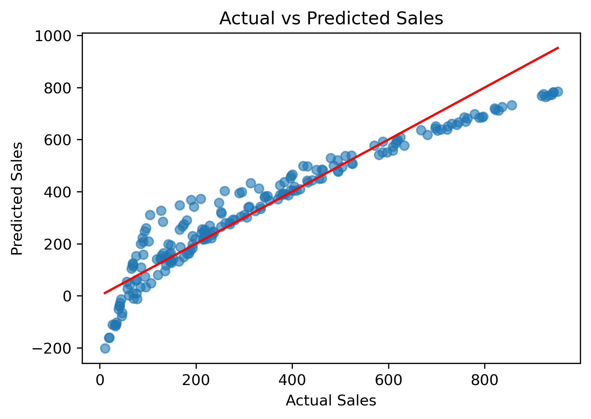
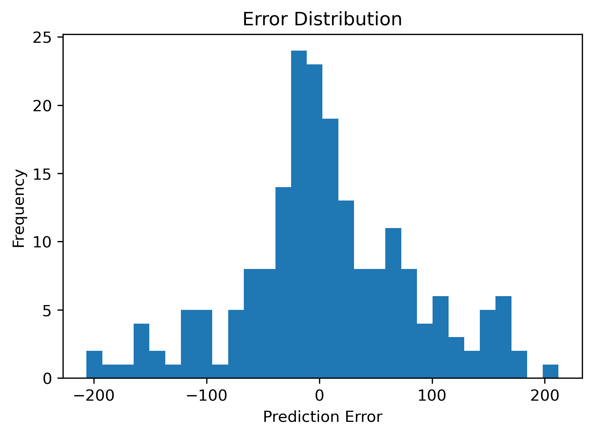

#  Supermarket Sales Analysis & Prediction

An end-to-end data analysis and machine learning project to explore sales patterns and predict transaction-level revenue.

---

##  Project Overview

This project analyzes supermarket sales data to uncover business insights and build a predictive model for estimating sales.

It combines:

- Exploratory Data Analysis (EDA)
- Interactive Dashboard (Streamlit)
- Machine Learning (Regression Model)

---

##  Dashboard Features

- Interactive filters (Branch, Product Line)
- KPI cards:
  - Total Revenue
  - Average Sales
  - Total Transactions
  - Average Rating
- Visualizations:
  - Sales by Product Line
  - Payment Method Distribution
  - Monthly Sales Trend
  - Sales by Gender
  - Sales by Customer Type

---

##  Machine Learning Model

A regression model is built to estimate **total sales per transaction**.

###  Input Features:

- Unit Price
- Quantity
- Customer Rating

###  Target:

- Sales (Revenue)

---

## 📈 Model Performance

| Metric   | Value |
| -------- | ----- |
| MAE      | 58.41 |
| RMSE     | 78.73 |
| R² Score | 0.90  |

=> The model explains approximately **90% of the variation in sales**, indicating strong predictive performance.

---

##  Model Evaluation Visualizations

###  Actual vs Predicted Sales



👉 Points close to the red line indicate accurate predictions.

---

###  Error Distribution



👉 Errors are centered around zero, showing good model accuracy.

---

##  Key Insights

- Sales are strongly influenced by **price and quantity**
- Certain product categories generate higher revenue
- Customer type and gender show different purchasing patterns
- Payment methods are evenly distributed
- Monthly trends show variation in sales performance

---

##  Business Value

This project demonstrates how data can be used to:

- Analyze retail performance
- Understand customer behavior
- Support pricing and sales strategies
- Build interactive dashboards
- Apply machine learning for prediction

---

##  Tech Stack

- Python
- Pandas
- NumPy
- Matplotlib
- Seaborn
- Scikit-learn
- Streamlit

---

##  Project Structure

```
Supermarket-Sale-Analysis/
│
├── data/
├── dashboard/
│ └── app.py
├── visuals/
│ ├── actual_vs_predicted.png
│ └── error_distribution.png
├── supermarket_sales_analysis.ipynb
├── README.md
```

##  How to Run

### 1. Clone the repository

```bash
git clone https://github.com/your-username/supermarket-sales-analysis-dashboard.git
cd Supermarket-Sale-Analysis
```

2. Install dependencies
```bash
pip install -r requirements.txt
```

3. Run dashboard
```bash
streamlit run dashboard/app.py
```

## Author

**Mainuddin Monsur Robin**
